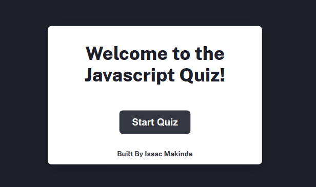
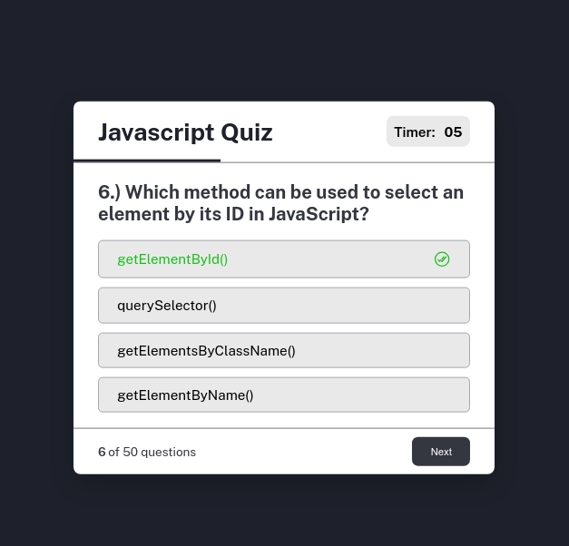
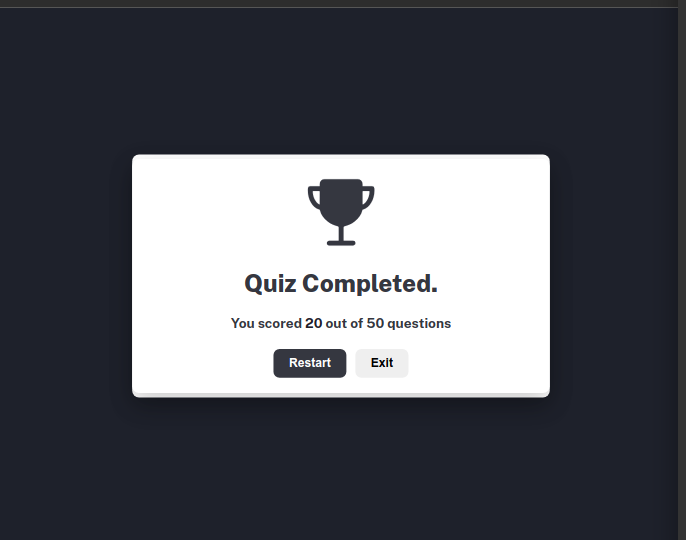

## Javascript Quiz App

This is a simple and Interactive quiz app.

## Usage and Features

- The Web app is a multiple choice quiz that asks the users 50 questions.

- The user score will be displayed at the end of the quiz based on the number of correct answers.

- The Web app also has a timer that counts down from 10 seconds for each question.

- If time is up users won't be able to choose an answer.

### Screenshot

## Development

- Repository : [Solution](https://github.com/Oluwa-Laughter/Javascript-Quiz-App)
- Web App Url: [Live site](https://isaac-javascript-quiz-app.netlify.app/)

## Built Using

- HTML
- CSS
- Javascript

## Project By

- Website - [Isaac Makinde](https://github.com/Oluwa-Laughter)

- Twitter - [LAUGHTER](https://www.twitter.com/isaacmakinde_)

- Linkedin - [Isaac Makinde](https://www.linkedin.com/in/isaacmakinde/)
